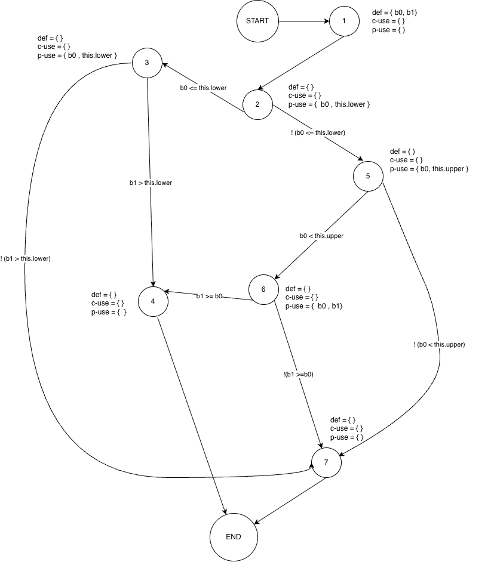

**SENG 637 - Dependability and Reliability of Software Systems**

**Lab. Report #3 – Code Coverage, Adequacy Criteria and Test Case Correlation**

| Group 4      |
|-----------------|
| Zohara Kamal            |   
| Thanoshan Vijayanandan          |   
| Minh Le                |   
| Shuvam Agarwala              | 

# Table of Contents

# 1 Introduction

This assignment focuses on improving test coverage (white-box coverage criteria) two different classes: `org.jfree.data.Range` and `org.jfree.data.DataUtilities`, using testing tools such as EclEmma, CodeCover, and JaCoCo.

# 2 Manual data-flow coverage calculations for X and Y methods

## DataUtilities.calculateColumnTotal(Values2D data, int column)

### data flow graph
.drawio.png)

### def-use sets per statement

| Node | Statement | def | c-use | p-use |
|------|-----------|-----|-------|-------|
| 1 | `public static double calculateColumnTotal(Values2D data, int column)` | { data, column } | { } | { } |
| 2 | `ParamChecks.nullNotPermitted(data, "data")` | { } | { data } | { } |
| 3 | `double total = 0.0; int rowCount = data.getRowCount()` | { total, rowCount } | { data } | { } |
| 4 | `int r = 0; r < rowCount` | { r } | { } | { r, rowCount } |
| 5 | `Number n = data.getValue(r, column)` | { n } | { data, r, column } | { n } |
| 6 | `total += n.doubleValue()` | { total } | { total, n } | { } |
| 7 | `r++` | { r } | { r } | { } |
| 8 | `int r2 = 0; r2 > rowCount` | { r2 } | { } | { r2, rowCount } |
| 9 | `Number n = data.getValue(r2, column)` | { n } | { data, r2, column } | { n } |
| 10 | `total += n.doubleValue()` | { total } | { total, n } | { } |
| 11 | `r2++` | { r2 } | { r2 } | { } |
| 12 | `return total` | { } | { total } | { } |

### DU-pairs per variable
| Variable | DU-pairs |
|----------|----------|
| data | (1,2), (1,3), (1,5), (1,9) |
| column | (1,5), (1,9) |
| total | (3,6), (3,10), (3,12), (6,6), (6,10), (6,12), (10,6), (10,10), (10,12) |
| rowCount | (3,4), (3,8) |
| r | (4,4), (4,5), (4,7), (7,4), (7,5), (7,7) |
| r2 | (8,8), (8,9), (8,11), (11,8), (11,9), (11,11) |
| n | (5,5), (5,6), (9,9), (9,10) |

### Pairs covered for each test case
| Test Case | DU-pairs Covered |
|-----------|------------------|
| TC1 | (1,2) (1,3) (1,5) (3,4) (3,6) (3,12) (6,6) (6,12) (4,4) (4,5) (4,7) (7,4) (7,5) (7,7) (5,5) (5,6) |
| TC2 | (1,2) (1,3) (1,5) (3,4) (3,6) (3,12) (6,6) (6,12) (4,4) (4,5) (4,7) (7,4) (7,5) (7,7) (5,5) (5,6) |
| TC3 | (1,2) (1,3) (1,5) (3,4) (3,6) (3,12) (6,6) (6,12) (4,4) (4,5) (4,7) (7,4) (7,5) (7,7) (5,5) (5,6) |
| TC5 | (1,2) (1,3) (1,5) (3,4) (3,6) (3,12) (6,12) (4,4) (4,5) (4,7) (5,5) (5,6) |
| TC6 | (1,2) (1,3) (1,5) (3,4) (3,6) (3,12) (6,6) (6,12) (4,4) (4,5) (4,7) (7,4) (7,5) (7,7) (5,5) (5,6) |
| TC7 | (1,2) (1,3) (3,4) (3,12) (4,4) |
| TC8 | (1,2) (1,3) (1,5) (3,4) (3,12) (4,4) (4,5) (4,7) (7,4) (7,5) (7,7) (5,5) |
| TC9 | (1,2) (1,3) (1,5) (3,4) (3,6) (3,12) (6,12) (4,4) (4,5) (4,7) (7,4) (7,5) (7,7) (5,5) (5,6) |
| TC10 | (1,2) (1,3) (1,5) (3,4) (3,6) (3,12) (6,6) (6,12) (4,4) (4,5) (4,7) (7,4) (7,5) (7,7) (5,5) (5,6) |
| TC12 | (1,2) (1,3) (1,5) (3,4) (3,6) (3,12) (6,6) (6,12) (4,4) (4,5) (4,7) (7,4) (7,5) (7,7) (5,5) (5,6) |
| TC14 | (1,2) |
| TC_NEG1 | (1,2) (1,3) (1,9) (3,4) (3,8) (3,10) (10,12) (4,4) (8,8) (8,9) (8,11) (11,8) (11,9) (11,11) (9,9) (9,10) |
| TC_NEG2 | (1,2) (1,3) (1,9) (3,4) (3,8) (3,12) (4,4) (8,8) (8,9) (8,11) (11,8) (11,9) (11,11) (9,9) |

## Range.intersects(double b0, double b1)

### data flow graph

### def-use sets per statement

| Node | Statement | def | c-use | p-use |
|------|-----------|-----|-------|-------|
| 1 | `public boolean intersects(double b0, double b1)` | { b0, b1 } | { } | { } |
| 2 | `if (b0 <= this.lower)` | { } | { } | { b0, this.lower } |
| 3 | `return (b1 > this.lower)` | { } | { } | { b0, this.lower } |
| 4 | `return false` | { } | { } | { } |
| 5 | `b0 < this.upper` | { } | { } | { b0, this.upper } |
| 6 | `b1 >= b0` | { } | { } | { b0, b1 } |
| 7 | `return false` | { } | { } | { } |

### DU-pairs per variable

| Variable | DU-pairs |
|----------|----------|
| b0 | (1,2), (1,3), (1,5), (1,6) |
| b1 | (1,3), (1,6) |
| this.lower | (2,2), (2,3) |
| this.upper | (5,5) |

### Pairs covered for each test case

| Test Case | DU-pairs Covered |
|-----------|------------------|
| testLowerJustBelowLowerBoundTouchesLower | (1,2) (1,3) (2,2) (2,3) |
| testLowerJustBelowLowerBoundOverlapsSlightly | (1,2) (1,3) (2,2) (2,3) |
| testLowerJustBelowLowerBoundSpansAll | (1,2) (1,3) (2,2) (2,3) |
| testLowerAtLowerBoundOverlapsSlightly | (1,2) (1,3) (2,2) (2,3) |
| testLowerAtLowerBoundMatchesRange | (1,2) (1,3) (2,2) (2,3) |
| testLowerInsideRangeNormalValues | (1,2) (1,5) (1,6) (2,2) |
| testLowerInsideRangeEndsAtUpper | (1,2) (1,5) (1,6) (2,2) |
| testLowerAtUpperBoundOverlapsSlightly | (1,2) (1,5) (1,6) (2,2) |
| testLowerMinValueUpperBeyondRange | (1,2) (1,5) (1,6) (2,2) |
| testLowerJustBelowLowerUpperMaxValue | (1,2) (1,3) (2,2) (2,3) |
| testSinglePointInsideRange | (1,2) (1,5) (1,6) (2,2) |
| testCase12_NaNLower | (1,2) (1,5) (1,7) (2,2) |
| testLowerInsideUpperNaN | (1,2) (1,5) (1,6) (2,2) |
| testSinglePointAtLowerBound | (1,2) (1,3) (2,2) (2,3) |
| testSinglePointAtUpperBound | (1,2) (1,5) (1,6) (2,2) |
| testIntersectWithComputedNaNLowerBound | (1,2) (1,5) (1,7) (2,2) |
| testIntersectWithComputedNaNUpperBound | (1,2) (1,5) (1,6) (2,2) |

# 3 A detailed description of the testing strategy for the new unit test

To create additional unit tests, we followed a systematic approach.

First, we executed the test cases from the test classes developed in Assignment 2 to obtain the initial coverage metrics. Since EclEmma is integrated into Eclipse, we ran the tests using the "Coverage As -> JUnit Test" option to measure the coverage. We then recorded the line, branch, and method coverage metrics for each test class.

For methods that did not satisfy the required coverage thresholds, we carefully inspected the corresponding source code. EclEmma visually highlighted the sections and branches that were not executed by the existing tests. Using this information, we designed additional test cases with appropriate inputs to exercise those uncovered execution paths.

After adding each new test case, we reran the coverage analysis to observe whether the coverage metrics improved. This iterative process continued until satisfactory coverage was achieved. The same procedure was repeated for all relevant methods to ensure that the coverage requirements were met.

# 5. A high level description of five selected test cases you have designed using coverage information, and how they have increased code coverage

# 6. A detailed report of the coverage achieved of each class and method (a screen shot from the code cover results in green and red color would suffice)

Text…

# 7. Pros and Cons of coverage tools used and Metrics you report

In this report, we used **EclEmma** to measure and report the coverage metrics. EclEmma supports instruction coverage, branch coverage, method coverage, and line coverage. However, it does not provide support for condition coverage.

We also experimented with several other tools in an attempt to obtain condition coverage metrics, but we were unable to successfully configure them to produce the required results.

We tried to install **Coverlipse** Eclipse plugin. They recommended update mechanism to get Coverlipse in Eclispe - [webpage](https://coverlipse.sourceforge.net/download.php.html). We followed their instructions step-by-step. However, we got an error message "Could not find https://coverlipse.sf.net/update/".

Similarly, we tried to install **CodeCover** Eclipse Plugin by looking at their [documentation](http://codecover.org/documentation/install.html). But, we received error message "Unable to read repository at https://update.codecover.org/content.xml."

Next, we explored **JaCoCo** by reviewing its official documentation and several related blog posts. During this process, we observed that JaCoCo supports integration with Apache Maven through configuration added to the pom.xml file. However, we were unable to identify a clear approach for properly configuring this integration within our project. Additionally, we discovered from the EclEmma documentation that, since version 2.0, EclEmma has been built on top of the JaCoCo code coverage library  - [documentation](https://www.eclemma.org/).

We haven't tried Clover and Cobertura. 

# 8. A comparison on the advantages and disadvantages of requirements-based test generation and coverage-based test generation.

| Aspect                     | Requirements-Based Test Generation                    | Coverage-Based Test Generation                                  |
| -------------------------- | ----------------------------------------------------- | --------------------------------------------------------------- |
| **Basis**                  | Derived from system requirements.                     | Derived from program structure.                                 |
| **Testing Approach**       | Black-box testing (focus on system behavior).         | White-box testing (focus on code structure).                    |
| **Evaluation**             | Measured by how well requirements are tested.         | Measured using coverage metrics (statement, branch, condition). |
| **Advantages**             | Ensures system functionality matches requirements.    | Helps identify untested code and logical paths.                 |
| **Disadvantages**          | May miss internal code paths and hidden defects.      | High coverage does not guarantee correct functionality.         |
| **Dependency**             | Depends on the quality of requirements.               | Depends on program structure and coverage criteria.             |

# 8 A discussion on how the team work/effort was divided and managed

### Measure Data Flow Coverage Manually
For this task, Zohara and Shuvam worked on DataUtilities.calculateColumnTotal, and Minh and Thanoshan worked on Range.intersects. After the two pairs finished the work, we reviewed each other's work.

### Test Suite Development
The table below summarizes how the test suite development were distributed among the team members.

| Method | Member |
|--------|--------|
| `Range.expandToInclude(Range range, double value)` | Minh |
| `Range.intersects(double lower, double upper)` | Minh |
| `Range.contains(double value)` | Thanoshan |
| `Range.shift(Range base, double delta, boolean allowZeroCrossing)` | Thanoshan |
| `Range.getLength()` | Shuvam |
| `DataUtilities.createNumberArray(double[] data)` | Shuvam |
| `DataUtilities.createNumberArray2D(double[][] data)` | Shuvam |
| `DataUtilities.calculateColumnTotal(Values2D data, int column)` | Thanoshan |
| `DataUtilities.calculateRowTotal(Values2D data, int row)` | Zohara |
| `DataUtilities.getCumulativePercentages(KeyedValues data)` | Minh |

# 9 Any difficulties encountered, challenges overcome, and lessons learned from performing the lab

* We had difficulties in installing other code coverage tools. We tried various approaches by looking through multiple webpages, but unfortunately we couldn't run them in our Eclipse project.

* Some branches were difficult to reach because they required specific input combinations or exceptional conditions. Identifying these scenarios required careful examination of the source code and the control flow of the methods.

* We found that some methods have dead code (for example, loops), and infinite loops. Through this process, we learned that achieving high coverage is not always straightforward and often requires a detailed understanding of the underlying implementation.

# 10 Comments/feedback on the lab itself

* This assignment provided valuable experience in using code coverage tools, analyzing their metrics, writing new test cases, and improving overall test coverage.

* EclEmma's integration with Eclipse made executing coverage tasks straightforward.

* We gained a clear understanding of data-flow coverage.

* The assignment instructions were detailed and easy to follow.
