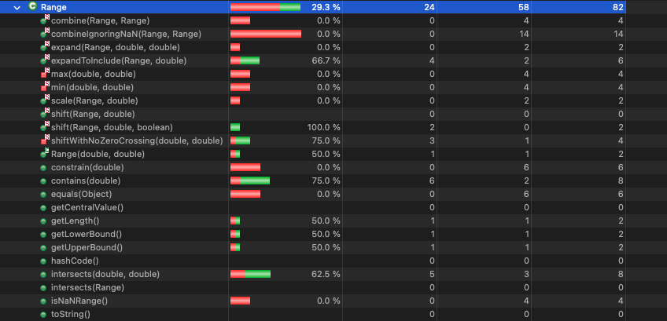
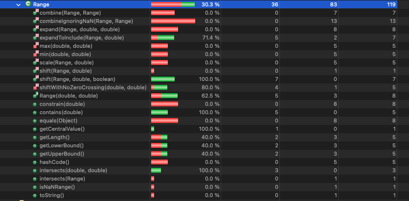
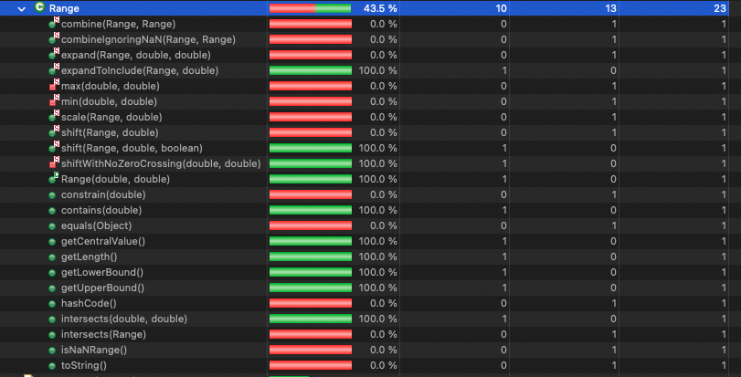
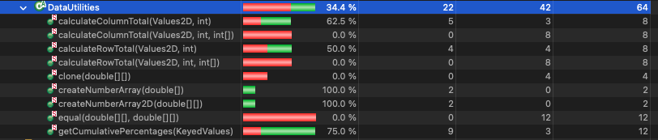
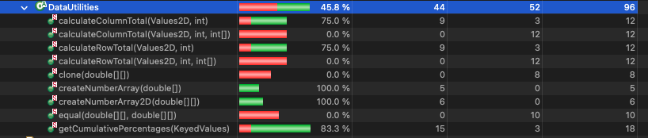
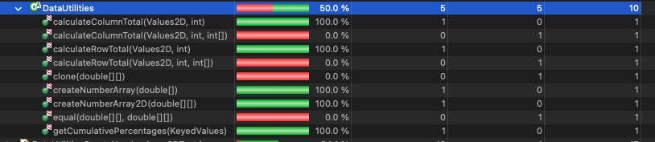
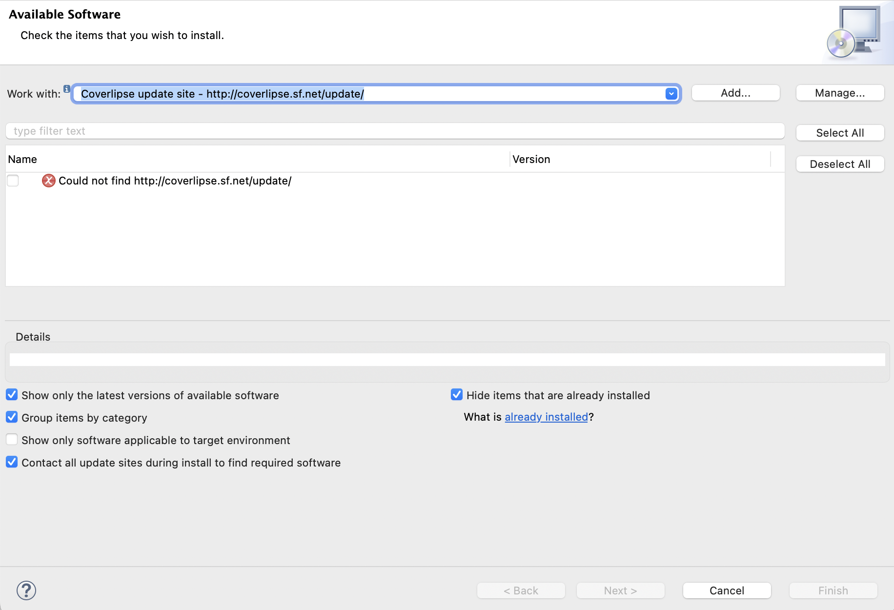
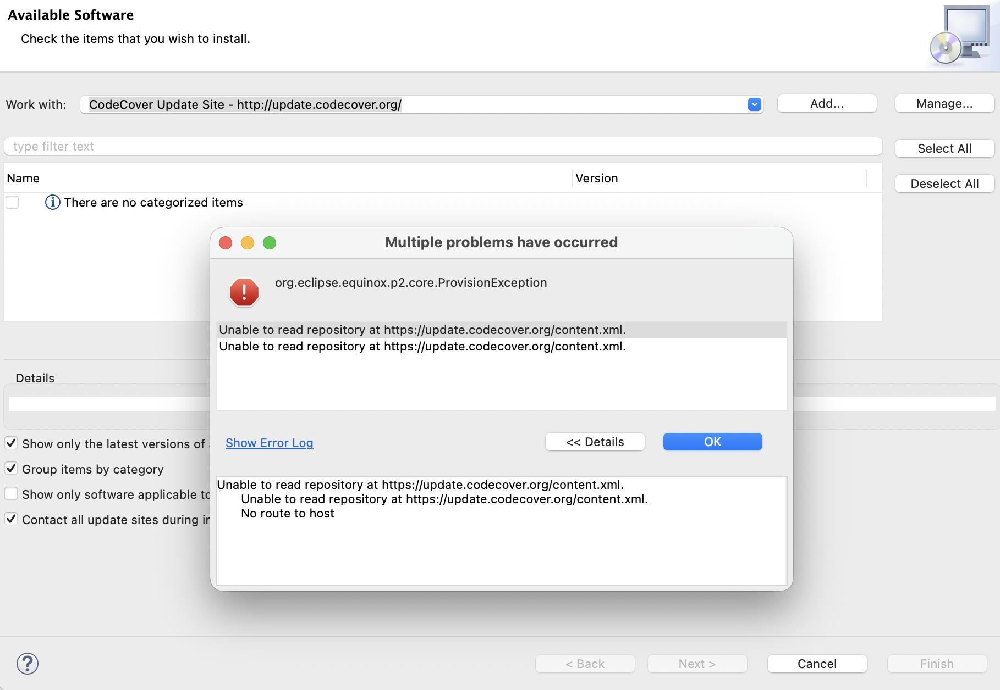

**SENG 637 - Dependability and Reliability of Software Systems**

**Lab. Report #3 – Code Coverage, Adequacy Criteria and Test Case Correlation**

| Group 4      |
|-----------------|
| Zohara Kamal            |   
| Thanoshan Vijayanandan          |   
| Minh Le                |   
| Shuvam Agarwala              | 

# Table of Contents


# 1. Introduction

This assignment focuses on improving test coverage (white-box coverage criteria) two different classes: `org.jfree.data.Range` and `org.jfree.data.DataUtilities`, using testing tools such as EclEmma, CodeCover, and JaCoCo.

# 2. Coverage screenshots of each class and method (Measure Control Flow Coverage)

## Coverage of `Range` class - BEFORE

Branch coverage of Range class



Line coverage of Range class



Method coverage of Range class



## Coverage of `Range` class - AFTER NEW TESTS

Branch coverage of Range class

Line coverage of Range class

Method coverage of Range class

## Coverage of `DataUtilities` class - BEFORE

Branch coverage of DataUtilities class



Line coverage of DataUtilities class



Method coverage of DataUtilities class



## Coverage of `DataUtilities` class - AFTER NEW TESTS

Branch coverage of DataUtilities class

Line coverage of DataUtilities class

Method coverage of DataUtilities class

# 3. Manual data-flow coverage calculations for X and Y methods

Text…

# 4. A detailed description of the testing strategy for the new unit test

To create additional unit tests, we followed a systematic approach.

First, we executed the test cases from the test classes developed in Assignment 2 to obtain the initial coverage metrics. Since EclEmma is integrated into Eclipse, we ran the tests using the "Coverage As -> JUnit Test" option to measure the coverage. We then recorded the line, branch, and method coverage metrics for each test class.

For methods that did not satisfy the required coverage thresholds, we carefully inspected the corresponding source code. EclEmma visually highlighted the sections and branches that were not executed by the existing tests. Using this information, we designed additional test cases with appropriate inputs to exercise those uncovered execution paths.

After adding each new test case, we reran the coverage analysis to observe whether the coverage metrics improved. This iterative process continued until satisfactory coverage was achieved. The same procedure was repeated for all relevant methods to ensure that the coverage requirements were met.

# 5. A high level description of five selected example test cases that have designed using coverage information, and how they have increased code coverage

## 5.1. Range.intersect(double lower, double upper)

Before adding test case `Range.intersect(double lower, double upper)`, the coverage calculated using EclEmma was as mentioned in below table.

| Counter      | Coverage |
| ------------ | -------- |
| Branches     | 62.5 %  |
| Lines        | 71.4 %  |
| Methods      | 100.0 %  |

The missing branch that we needed these tests for is the false outcome of the comparison conditions when `NaN` is involved.

```java
lower < this.upper  →false
upper >=lower       →false
```

When normal numbers are used, these conditions are usually true for many intervals, so the false path may never execute.

These tests are added to check the behavior of `intersects()` when one of the bounds is `NaN`. In Java, any comparison involving `NaN` always returns false. Because of this, conditions such as `lower < this.upper`, or `upper >= lower`evaluate to false and force the method to execute branches that may not occur with normal numeric inputs.

Therefore, these tests help cover the false branches of the comparison conditions, improving the branch coverage of the method.

```java
// Test behaviour when the lower bound is NaN using computed values
@Test
public void testIntersectWithComputedNaNLowerBound() {

    double nanValue = Math.sqrt(-1);   
    double upperBound = 0.5 + 0.5;

    boolean result = baseRange.intersects(nanValue, upperBound);

    assertFalse("Intersection should be false when lower bound is NaN", result);
}

// Test behaviour when the upper bound becomes NaN during computation
@Test
public void testIntersectWithComputedNaNUpperBound() {

    double lowerBound = baseRange.getLowerBound() + 1;
    double nanValue = Double.NaN * 5;

    boolean result = baseRange.intersects(lowerBound, nanValue);

    assertFalse("Intersection should be false when upper bound is NaN", result);
}
```

With the addition of this test case, we see improvements in all coverage counters like methods, branches, lines as again calculated using EclEmma.

| Counter      | Coverage |
| ------------ | -------- |
| Branches     | 100.0 %  |
| Lines        | 100.0 %  |
| Methods      | 100.0 %  |


## 5.2. Range.expandToInclude(Range range, double value)

Before adding test case `Range.expandToInclude(Range range, double value)`, the coverage calculated using EclEmma was as mentioned in below table.

| Counter      | Coverage |
| ------------ | -------- |
| Branches     | 66.7 %  |
| Lines        | 100.0 %  |
| Methods      | 100.0 %  |


The missing branches that required these additional tests are the outcomes of the comparison conditions when the input value lies far outside the current range boundaries or involves extreme floating-point values.

```java
value > range.getUpperBound() →true
value < range.getLowerBound() →true
valuewithin existing range    →true
range ==null                  →true
```

When normal input values are used, the provided value is often within the existing range, so the conditions that expand the lower or upper bound may not execute.

These tests are added to evaluate the behavior of `expandToInclude()` when the input value is slightly outside the current boundary or represents extreme floating-point values such as `Double.MAX_VALUE`, `-Double.MAX_VALUE`, and `Double.MIN_VALUE`. 

Such values force the method to evaluate different comparison outcomes that determine whether the range should expand upward, expand downward, or remain unchanged. Additionally, the test involving a `null` range and a `NaN` value checks the method’s behavior under undefined or exceptional input conditions.


```java
// Verify that the range expands when the value slightly exceeds the current upper bound
@Test
public void testExpansionWhenValueMarginallyExceedsUpperLimit() {
    double value = baseRange.getUpperBound() + 0.00001;
    Range expandedRange = Range.expandToInclude(baseRange, value);

    assertEquals(baseRange.getLowerBound(), expandedRange.getLowerBound(), 1e-9);
    assertEquals(value, expandedRange.getUpperBound(), 1e-9);
}

// Verify behaviour when the value is the largest representable double
@Test
public void testExpansionWithLargestPossibleDoubleValue() {
    double extremeValue = Double.MAX_VALUE;
    Range expandedRange = Range.expandToInclude(baseRange, extremeValue);

    assertEquals(baseRange.getLowerBound(), expandedRange.getLowerBound(), 1e-9);
    assertEquals(extremeValue, expandedRange.getUpperBound(), 1e-9);
}

// Verify that the lower bound expands when the input value is an extremely large negative number
@Test
public void testExpansionWithExtremeNegativeDoubleValue() {
    double extremeNegative = -Double.MAX_VALUE;
    Range expandedRange = Range.expandToInclude(baseRange, extremeNegative);

    assertEquals(extremeNegative, expandedRange.getLowerBound(), 1e-9);
    assertEquals(baseRange.getUpperBound(), expandedRange.getUpperBound(), 1e-9);
}

// Verify behaviour when the value is extremely small but positive
@Test
public void testExpansionWithSmallestPositiveDouble() {
    double verySmallValue = Double.MIN_VALUE;
    Range expandedRange = Range.expandToInclude(baseRange, verySmallValue);

    assertEquals(baseRange.getLowerBound(), expandedRange.getLowerBound(), 1e-9);
    assertEquals(baseRange.getUpperBound(), expandedRange.getUpperBound(), 1e-9);
}
```

With the addition of this test case, we see improvements in all coverage counters like methods, branches, lines as again calculated using EclEmma.

| Counter      | Coverage |
| ------------ | -------- |
| Branches     | 100.0 %  |
| Lines        | 100.0 %  |
| Methods      | 100.0 %  |

## 5.3. Range.contains(double value)

Before adding test case `Range.contains(double value)`, the coverage calculated using EclEmma was as mentioned in below table.

| Counter      | Coverage |
| ------------ | -------- |
| Branches     | 75.0 %  |
| Lines        | 100.0 %  |
| Methods      | 100.0 %  |


The final `return` statement `return (value >= this.lower && value <= this.upper)` had 2 out of 4 branches uncovered - specifically the false evaluations of `value >= this.lower` and `value <= this.upper`

These branches were structurally unreachable by normal numeric values because the two early guard statements already intercepted any value that would make the final condition evaluate to false

To cover the false branch of `value >= this.lower`, test case 15 was added using `Double.NaN` as the input value - since any comparison with `NaN` in Java returns `false`, it bypasses the guards but causes `NaN >= 5` to evaluate `false`

To cover the false branch of `value <= this.upper`, test case 16 was added using `Range(5, Double.NaN)` with input `50` - this passes both guards but causes `50 <= NaN` to evaluate `false`


```java
// Covers FALSE branch of (value >= this.lower) in final return
@Test
public void doesNotContainNaNAsValue() {
    Range range = new Range(5, 95);
    assertFalse("Range(5, 95) should not contain Double.NaN",
            range.contains(Double.NaN));
}

// Covers FALSE branch of (value <= this.upper) in final return
@Test
public void doesNotContainValueWhenUpperBoundIsNaN() {
    Range range = new Range(5, Double.NaN);
    assertFalse("Range(5, NaN) should not contain value 50",
            range.contains(50));
}
```

With the addition of this test case, we see improvements in all coverage counters like methods, branches, lines as again calculated using EclEmma.

| Counter      | Coverage |
| ------------ | -------- |
| Branches     | 100.0 %  |
| Lines        | 100.0 %  |
| Methods      | 100.0 %  |


## 5.4. Range.calculateColumnTotal(Values2D data, int column)

Before adding test case `Range.calculateColumnTotal(Values2D data, int column)`, the coverage calculated using EclEmma was as mentioned in below table.

| Counter      | Coverage |
| ------------ | -------- |
| Branches     | 62.5%  |
| Lines        | 75%  |
| Methods      | 100.0 %  |


Loop `for (int r2 = 0; r2 > rowCount; r2++)` had 3 out of 4 branches uncovered, specifically the true evaluation of `r2 > rowCount`, and both the true and false evaluations of `n != null` inside the second loop

To cover the true branch of `r2 > rowCount` and the true branch of `n != null` inside the second loop, `testNegativeRowCount_nonNullValue_addsToTotal` was added using `rowCount = -1` — since `0 > -1` evaluates to true, the loop is entered and `getValue` returns `7.0` (non-null), exercising the `total += n.doubleValue()` line

To cover the true branch of `r2 > rowCount` and the false branch of `n != null` inside the second loop, `testNegativeRowCount_nullValue_returnsZero` was added using `rowCount = -1` - the loop is entered but `getValue` returns `null`, exercising the skip path


```java
// second loop condition (true), n != null (true branch)
@Test(timeout = 1000)
public void testNegativeRowCount_nonNullValue_addsToTotal() {
    context.checking(new Expectations() {{
        allowing(values).getRowCount(); will(returnValue(-1));
        allowing(values).getValue(with(any(Integer.class)), with(equal(0)));
            will(returnValue(7.0));
    }});

    double result = DataUtilities.calculateColumnTotal(values, 0);
    assertEquals(7.0, result, 1e-9);
}

// second loop condition (true), n != null (false branch)
@Test(timeout = 1000)
public void testNegativeRowCount_nullValue_returnsZero() {
    context.checking(new Expectations() {{
        allowing(values).getRowCount(); will(returnValue(-1));
        allowing(values).getValue(with(any(Integer.class)), with(equal(0)));
            will(returnValue(null));
    }});

    double result = DataUtilities.calculateColumnTotal(values, 0);
    assertEquals(0.0, result, 1e-9);
}
```

With the addition of this test case, we see improvements in all coverage counters like methods, branches, lines as again calculated using EclEmma.

| Counter      | Coverage |
| ------------ | -------- |
| Branches     | 100.0 %  |
| Lines        | 100.0 %  |
| Methods      | 100.0 %  |


## 5.5. Range.calculateRowTotal(Values2D data, int row)

Before adding test case `Range.calculateRowTotal(Values2D data, int row)`, the coverage calculated using EclEmma was as mentioned in below table.

| Counter      | Coverage |
| ------------ | -------- |
| Branches     | 62.5%  |
| Lines        | 75%  |
| Methods      | 100.0 %  |


Added test case to cover the `null` branch of `if (n != null)` in the first loop: mocked one cell returning `null` and one returning `3.0`, verifying the null cell is skipped and only the non-null value contributes to the total.

Added test case to further confirm the `null` branch: mocked all cells returning `null`, verifying the total remains `0.0` when every cell is skipped.

Added test case to enter the second loop body by passing a negative `columnCount` (`1`), forcing `c2 > columnCount` to be true. Mocked `getValue(0, 0)` returning `5.0` to cover the inner `if (n != null)` true branch, verifying the non-null value is accumulated correctly.

Added test case to cover the inner `if (n != null)` false branch inside the second loop: same negative `columnCount` setup but `getValue(0, 0)` returns `null`, verifying the total stays `0.0` when the value is skipped. 

Note that both TC17 and TC18 expose a source code defect - the second loop condition `c2 > columnCount` is a likely copy-paste error of `c2 < columnCount`, causing an infinite loop under normal conditions.


```java
// Verifies that calculateRowTotal ignores null cell values and sums only non-null values
@Test
public void calculateRowTotal_ignoresNullCellValue_returnsSumOfNonNullCells() {
    context.checking(new Expectations() {{
        allowing(values).getRowCount(); will(returnValue(1));
        allowing(values).getColumnCount(); will(returnValue(2));
        allowing(values).getValue(0, 0); will(returnValue(null));
        allowing(values).getValue(0, 1); will(returnValue(3.0));
    }});

    double result = DataUtilities.calculateRowTotal(values, 0);
    assertEquals(3.0, result, 1e-9);
}

// Verifies that calculateRowTotal returns 0 when all values in the row are null
@Test
public void calculateRowTotal_allCellValuesNull_returnsZero() {
    context.checking(new Expectations() {{
        allowing(values).getRowCount(); will(returnValue(1));
        allowing(values).getColumnCount(); will(returnValue(2));
        allowing(values).getValue(0, 0); will(returnValue(null));
        allowing(values).getValue(0, 1); will(returnValue(null));
    }});

    double result = DataUtilities.calculateRowTotal(values, 0);
    assertEquals(0.0, result, 1e-9);
}

// Verifies behavior when column count is negative but a non-null value exists
@Test
public void calculateRowTotal_negativeColumnCount_withNonNullValue_returnsValue() {
    context.checking(new Expectations() {{
        allowing(values).getRowCount(); will(returnValue(1));
        allowing(values).getColumnCount(); will(returnValue(-1));
        allowing(values).getValue(0, 0); will(returnValue(5.0));
    }});

    double result = DataUtilities.calculateRowTotal(values, 0);
    assertEquals(5.0, result, 1e-9);
}

// Verifies behavior when column count is negative and the value is null
@Test
public void calculateRowTotal_negativeColumnCount_withNullValue_returnsZero() {
    context.checking(new Expectations() {{
        allowing(values).getRowCount(); will(returnValue(1));
        allowing(values).getColumnCount(); will(returnValue(-1));
        allowing(values).getValue(0, 0); will(returnValue(null));
    }});

    double result = DataUtilities.calculateRowTotal(values, 0);
    assertEquals(0.0, result, 1e-9);
}
```

With the addition of this test case, we see improvements in all coverage counters like methods, branches, lines as again calculated using EclEmma.

| Counter      | Coverage |
| ------------ | -------- |
| Branches     | 100.0 %  |
| Lines        | 100.0 %  |
| Methods      | 100.0 %  |


# 6. Code cover results in green and red color for Range and DataUtilities class after the improvement


# 7. Pros and Cons of coverage tools used and Metrics you report

In this report, we used **EclEmma** to measure and report the coverage metrics. EclEmma supports instruction coverage, branch coverage, method coverage, and line coverage. However, it does not provide support for condition coverage.

We also experimented with several other tools in an attempt to obtain condition coverage metrics, but we were unable to successfully configure them to produce the required results.

We tried to install **Coverlipse** Eclipse plugin. They recommended update mechanism to get Coverlipse in Eclispe - [webpage](https://coverlipse.sourceforge.net/download.php.html). We followed their instructions step-by-step. However, we got an error message "Could not find https://coverlipse.sf.net/update/".



Similarly, we tried to install **CodeCover** Eclipse Plugin by looking at their [documentation](http://codecover.org/documentation/install.html). But, we received error message "Unable to read repository at https://update.codecover.org/content.xml."



Next, we explored **JaCoCo** by reviewing its official documentation and several related blog posts. During this process, we observed that JaCoCo supports integration with Apache Maven through configuration added to the pom.xml file. However, we were unable to identify a clear approach for properly configuring this integration within our project. Additionally, we discovered from the EclEmma documentation that, since version 2.0, EclEmma has been built on top of the JaCoCo code coverage library  - [documentation](https://www.eclemma.org/).

We haven't tried Clover and Cobertura. 

# 8. A comparison on the advantages and disadvantages of requirements-based test generation and coverage-based test generation.

| Aspect                     | Requirements-Based Test Generation                    | Coverage-Based Test Generation                                  |
| -------------------------- | ----------------------------------------------------- | --------------------------------------------------------------- |
| **Basis**                  | Derived from system requirements.                     | Derived from program structure.                                 |
| **Testing Approach**       | Black-box testing (focus on system behavior).         | White-box testing (focus on code structure).                    |
| **Evaluation**             | Measured by how well requirements are tested.         | Measured using coverage metrics (statement, branch, condition). |
| **Advantages**             | Ensures system functionality matches requirements.    | Helps identify untested code and logical paths.                 |
| **Disadvantages**          | May miss internal code paths and hidden defects.      | High coverage does not guarantee correct functionality.         |
| **Dependency**             | Depends on the quality of requirements.               | Depends on program structure and coverage criteria.             |


# 9. A discussion on how the team work/effort was divided and managed

### Measure Data Flow Coverage Manually
For this task, Zohara and Shuvam worked on DataUtilities.calculateColumnTotal, and Minh and Thanoshan worked on Range.intersects. After the two pairs finished the work, we reviewed each other's work.

### Test Suite Development
The table below summarizes how the test suite development were distributed among the team members.

| Method | Member |
|--------|--------|
| `Range.expandToInclude(Range range, double value)` | Minh |
| `Range.intersects(double lower, double upper)` | Minh |
| `Range.contains(double value)` | Thanoshan |
| `Range.shift(Range base, double delta, boolean allowZeroCrossing)` | Thanoshan |
| `Range.getLength()` | Shuvam |
| `DataUtilities.createNumberArray(double[] data)` | Shuvam |
| `DataUtilities.createNumberArray2D(double[][] data)` | Shuvam |
| `DataUtilities.calculateColumnTotal(Values2D data, int column)` | Thanoshan |
| `DataUtilities.calculateRowTotal(Values2D data, int row)` | Zohara |
| `DataUtilities.getCumulativePercentages(KeyedValues data)` | Minh |

# 10. Any difficulties encountered, challenges overcome, and lessons learned from performing the lab

* We had difficulties in installing other code coverage tools. We tried various approaches by looking through multiple webpages, but unfortunately we couldn't run them in our Eclipse project.

* Some branches were difficult to reach because they required specific input combinations or exceptional conditions. Identifying these scenarios required careful examination of the source code and the control flow of the methods.

* We found that some methods have dead code (for example, loops), and infinite loops. Through this process, we learned that achieving high coverage is not always straightforward and often requires a detailed understanding of the underlying implementation.

# 11. Comments/feedback on the lab itself

* This assignment provided valuable experience in using code coverage tools, analyzing their metrics, writing new test cases, and improving overall test coverage.

* EclEmma's integration with Eclipse made executing coverage tasks straightforward.

* We gained a clear understanding of data-flow coverage.

* The assignment instructions were detailed and easy to follow.
